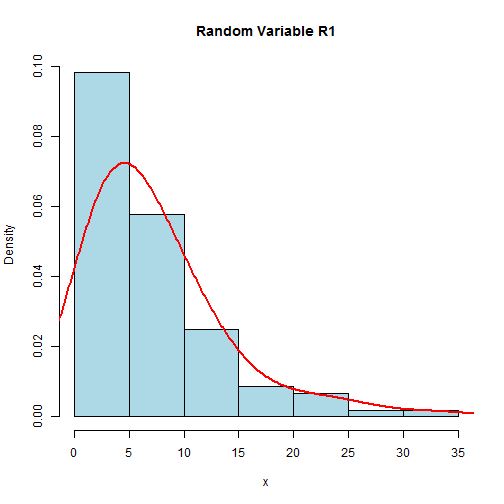
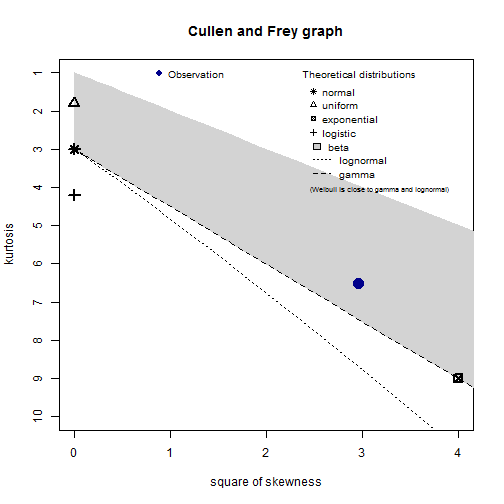
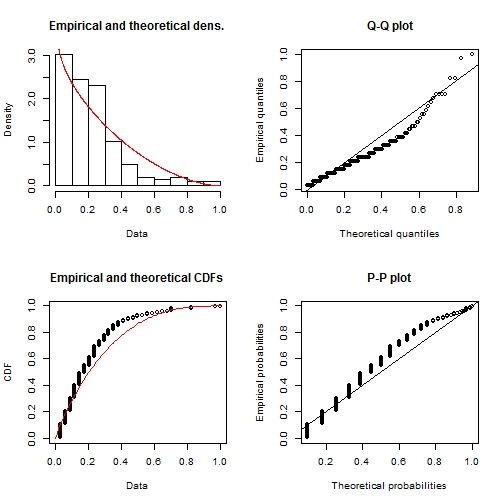
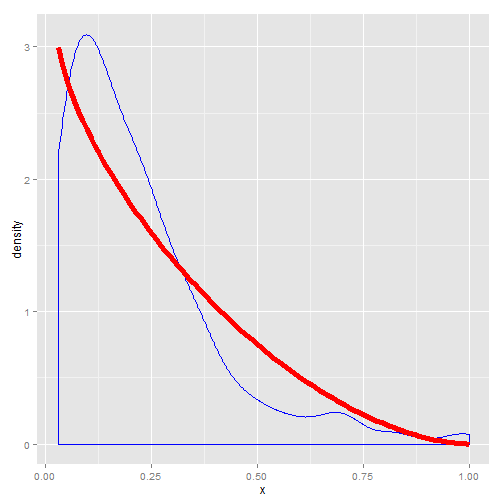
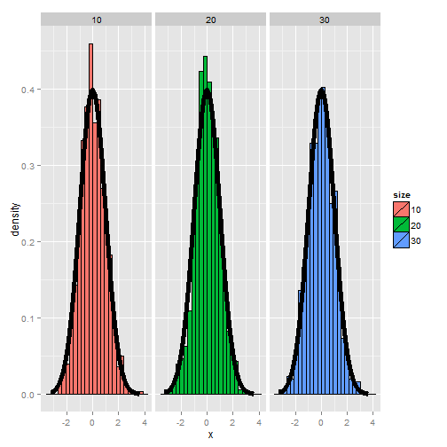

<html>
<body>

<a href="http://www.pronosticos.gob.mx/index.php/en/"><h2 style="color:blue">Melate</h2></a>

<h2 style="color:red">Lottery Game</h2>
<h4>by</h4>
<h3>Pedro Marquez</h3>

</body>
</html>

--- .class #id

<section data-background="Aquamarine">

### Load Libraries, Data and Initialize Game


```
##     CONCURSO R1 R2 R3 R4 R5 R6
## 1       2909  3  4  7 30 45 52
## 2       2908  5 13 23 33 44 56
## 3       2907  1 15 17 25 37 45
## 4       2906  5 15 28 37 46 49
## 5       2905  4 27 41 45 48 54
## 6       2904  3 15 20 36 40 56
## 7       2903  7 20 23 24 27 42
## 8       2902  5 16 25 27 35 45
## 9       2901  2  8  9 25 46 52
## 10      2900  2 13 18 20 21 52
## 11      2899 13 18 30 33 36 51
## 12      2898 10 18 25 33 38 49
## 13      2897  4  8 24 25 26 37
## 14      2896  9 10 15 41 46 49
## 15      2895 16 19 30 38 40 49
## 16      2894 12 13 16 26 30 49
## 17      2893  2 22 28 32 33 51
## 18      2892  1  3  5 24 42 46
## 19      2891 15 22 27 28 30 31
## 20      2890  8 16 17 26 31 37
## 21      2889  3 16 20 28 40 55
## 22      2888 13 14 23 35 37 40
## 23      2887 23 25 29 33 46 49
## 24      2886  5 13 19 29 30 56
## 25      2885  1 11 20 27 39 41
## 26      2884  2 16 30 35 51 53
## 27      2883 11 12 17 32 36 54
## 28      2882  1 15 26 30 49 52
## 29      2881 19 22 41 48 51 55
## 30      2880 12 16 30 32 37 49
## 31      2879  6  9 27 32 37 44
## 32      2878  1  5 10 17 34 40
## 33      2877  1 17 20 29 35 51
## 34      2876  3 16 28 30 40 54
## 35      2875  2  4 16 38 50 52
## 36      2874  3  6 23 25 34 35
## 37      2873  1  4 11 17 44 52
## 38      2872  4 10 12 22 32 51
## 39      2871 16 24 32 36 51 52
## 40      2870 14 33 42 45 51 55
## 41      2869  2 20 31 35 48 53
## 42      2868  1 10 11 33 37 47
## 43      2867  3 26 27 38 44 56
## 44      2866  7  8 23 34 47 52
## 45      2865  3  4 17 19 21 49
## 46      2864  7 23 25 29 33 50
## 47      2863 21 25 27 36 47 54
## 48      2862 11 12 18 40 53 56
## 49      2861  5  7 29 36 38 41
## 50      2860  9 14 22 35 37 47
## 51      2859 24 29 42 44 52 53
## 52      2858 10 28 33 37 46 52
## 53      2857  2 11 16 24 31 37
## 54      2856  6 15 20 24 37 51
## 55      2855  4  8 10 18 46 56
## 56      2854  7 18 23 31 35 36
## 57      2853  4 10 40 42 45 46
## 58      2852  5  6 14 15 31 46
## 59      2851 24 25 26 32 39 47
## 60      2850  3  7 17 38 39 50
## 61      2849  3 31 39 43 44 50
## 62      2848 22 33 40 41 42 48
## 63      2847  8 34 43 49 54 55
## 64      2846  9 18 28 29 41 50
## 65      2845  8 11 22 23 38 41
## 66      2844 11 17 19 24 43 49
## 67      2843 17 22 24 31 43 50
## 68      2842  4  5 25 35 48 53
## 69      2841  6  8 29 47 48 50
## 70      2840  4 25 31 44 49 56
## 71      2839  3 10 19 34 44 54
## 72      2838  8  9 11 20 22 40
## 73      2837  3  6 25 45 46 48
## 74      2836  3  6 11 24 31 51
## 75      2835  1  2 13 27 29 34
## 76      2834  6 17 27 32 34 40
## 77      2833  1 10 12 32 36 48
## 78      2832 24 27 40 41 54 55
## 79      2831  3  6 14 28 30 39
## 80      2830  5 12 22 41 44 47
## 81      2829  1 15 26 40 45 46
## 82      2828  4 15 18 30 38 49
## 83      2827  1  5 17 25 35 55
## 84      2826  9 14 35 46 49 55
## 85      2825  8 17 20 38 54 56
## 86      2824  8 17 19 36 37 41
## 87      2823 11 21 33 43 54 55
## 88      2822 12 22 36 43 46 52
## 89      2821  9 13 29 33 39 51
## 90      2820  6 16 21 32 43 56
## 91      2819  2  5 18 30 44 53
## 92      2818 12 31 37 44 52 55
## 93      2817  7 21 33 35 43 55
## 94      2816  3  6 22 38 40 56
## 95      2815 17 19 22 23 36 38
## 96      2814  9 17 22 26 49 56
## 97      2813  2  8 16 23 42 48
## 98      2812 28 30 32 34 42 43
## 99      2811  2 29 30 36 44 51
## 100     2810  6 30 34 46 50 52
## 101     2809 20 32 33 34 50 56
## 102     2808 10 17 20 31 50 51
## 103     2807  8  9 14 28 33 56
## 104     2806 11 12 17 29 30 34
## 105     2805  1 13 21 22 33 45
## 106     2804  3 10 14 28 48 56
## 107     2803  8 12 19 21 22 43
## 108     2802 11 22 25 29 37 55
## 109     2801 19 26 37 50 53 54
## 110     2800  8 15 35 37 41 48
## 111     2799 13 14 16 28 50 51
## 112     2798  8 14 20 42 43 55
## 113     2797  4  5 16 29 39 55
## 114     2796  2 17 39 48 53 56
## 115     2795  8 20 26 27 42 44
## 116     2794  7  8 20 37 39 45
## 117     2793  6 12 40 43 51 56
## 118     2792  8 13 18 22 40 54
## 119     2791  4  8 11 37 41 43
## 120     2790 33 35 47 52 53 56
## 121     2789  7 17 40 48 53 56
## 122     2788  3  6 40 41 47 48
## 123     2787  3  5 19 24 28 30
## 124     2786  4 15 16 30 44 50
## 125     2785  2 13 21 35 41 49
## 126     2784  3 29 30 38 42 50
## 127     2783 18 24 31 39 47 51
## 128     2782  1  3 16 19 20 28
## 129     2781 10 14 16 17 27 49
## 130     2780  1  5  6  8 30 46
## 131     2779 13 21 37 42 43 48
## 132     2778  1  3 12 22 35 55
## 133     2777 11 18 21 31 36 49
## 134     2776  5  8 26 32 37 39
## 135     2775  2  6 30 34 37 43
## 136     2774 12 25 31 36 46 54
## 137     2773  9 18 40 42 48 52
## 138     2772  5 26 30 34 37 56
## 139     2771  5 13 15 40 54 55
## 140     2770 14 18 50 51 52 56
## 141     2769  6 11 27 33 41 56
## 142     2768  5  7 44 51 53 54
## 143     2767  2  4 26 27 28 44
## 144     2766  4 15 16 34 44 56
## 145     2765  2 14 21 28 36 49
## 146     2764 10 23 29 45 53 56
## 147     2763  1  6 15 22 34 39
## 148     2762 14 33 41 43 52 56
## 149     2761  4  8 15 36 39 45
## 150     2760  4 11 12 40 45 51
## 151     2759 12 15 31 50 54 55
## 152     2758 12 20 33 46 50 51
## 153     2757  6 18 36 48 50 52
## 154     2756  5  6 33 34 46 55
## 155     2755  4 20 29 31 44 48
## 156     2754 11 18 31 35 39 42
## 157     2753  8 16 21 39 50 52
## 158     2752 15 17 19 22 31 53
## 159     2751 10 22 29 30 32 33
## 160     2750  6 19 23 25 28 42
## 161     2749  8 11 14 36 49 55
## 162     2748  2 14 27 42 46 50
## 163     2747 34 44 45 51 52 56
## 164     2746  7 11 26 38 39 56
## 165     2745  1 13 19 29 41 46
## 166     2744  1  9 12 19 31 34
## 167     2743  1  2  4 31 32 46
## 168     2742 10 26 40 44 50 54
## 169     2741  1  4 20 21 24 34
## 170     2740 28 31 32 44 51 52
## 171     2739  5 16 17 24 41 47
## 172     2738  4  6 20 21 45 55
## 173     2737 16 19 23 29 33 49
## 174     2736  7 24 27 39 45 52
## 175     2735 13 18 26 30 31 53
## 176     2734  2  7 10 27 34 54
## 177     2733 10 15 23 24 36 49
## 178     2732  3  6 19 28 48 52
## 179     2731  2  3  7 26 30 48
## 180     2730  5  7  8 23 26 55
## 181     2729  7  9 29 44 48 55
## 182     2728  5 16 30 31 38 52
## 183     2727  2  9 15 16 21 42
## 184     2726  7 14 23 26 43 49
## 185     2725  6 13 27 32 47 52
## 186     2724 13 15 19 33 49 53
## 187     2723  7 10 13 23 34 44
## 188     2722  1  5 28 48 49 55
## 189     2721  5  6  7 25 33 50
## 190     2720 24 30 40 41 55 56
## 191     2719  9 10 30 35 41 48
## 192     2718  5 13 20 32 36 56
## 193     2717  7 26 31 44 45 53
## 194     2716  8 16 18 46 52 55
## 195     2715  6 13 17 20 31 50
## 196     2714  4  5 22 28 31 37
## 197     2713  5 15 24 25 37 39
## 198     2712  2  7 12 35 51 54
## 199     2711  7 13 23 37 48 49
## 200     2710 10 29 32 42 43 47
## 201     2709  2 10 25 30 32 56
## 202     2708  4  5 30 43 45 51
## 203     2707  8  9 12 30 43 51
## 204     2706  4  9 20 25 28 37
## 205     2705  4 13 22 34 37 39
## 206     2704  4 19 24 39 49 55
## 207     2703  3  4 18 20 26 28
## 208     2702  8  9 23 37 48 53
```

---

### Visualyzing  Distributions

 

--- .class #id 

##### Selecting Distribution Type (for R1: Beta or Gamma)

 

```
## summary statistics
## ------
## min:  1   max:  34 
## median:  6 
## mean:  7.360577 
## estimated sd:  6.196445 
## estimated skewness:  1.719955 
## estimated kurtosis:  6.508291
```

--- .class #id 

### Analysing All Random Variables

See if they look Gaussian: $\displaystyle f(x;\mu,\lambda) = \frac{1}{\sigma \sqrt{2\pi}} e^{-\frac{(x-\mu)^2}{2\sigma^2}}$


```
##         mean       sd    skewness       kurtosis        
## 1:  7.360577 6.196445  1.70752637 right 6.395815 sharper
## 2: 14.860577 8.019589  0.70374365 right 3.148156 sharper
## 3: 23.980769 9.221882  0.33267933 right 2.682649 flatter
## 4: 32.990385 8.584893  0.05643897 right 2.498910 flatter
## 5: 40.855769 8.245530 -0.35455961  left 2.389366 flatter
## 6: 49.187500 6.447741 -1.15466654  left 3.786478 sharper
```

--- .class $id

#### Fitting a Distribution (R1)


```
## Fitting of the distribution ' beta ' by maximum likelihood 
## Parameters:
##        estimate Std. Error
## shape1 0.911517  0.0786541
## shape2 2.704400  0.2752100
```

```
## [1] -169.8144
```

 

--- .class #id

### Density Curve vs. Simulated Distribution

 

--- .class #id

## Checking Normality (of R1)

 

--- .class #id

## Suggested Game

##### (Showing Only Suggested Numbers for R1)


```
##    Game 1 Game 2 Game 3
## 1:     25      8     27
## 2:      0      0      0
## 3:      0      0      0
## 4:      0      0      0
## 5:      0      0      0
## 6:      0      0      0
```


